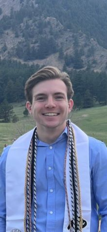

# Brandon Kohrt Personal Website      

  

  <a href="Brandon.Kohrt.Resume.pdf" target="_blank">Resume</a> | Email: brko5178@colorado.edu | Github: <a href="https://github.com/brko5178" target="_blank">brko5178</a>

# Background
  Hi, my name is Brandon Kohrt! I originally graduated from CU Boulder in 2023 with a degree in neuroscience and one in psychology. I currently work as a research assistant for the The Adolescent Brain and Cognitive Development study, which is a nationwide longitudinal study that is looking at the brain development of adolescents aged 10-20. 
  
I started in the University of Colorado Boulder Computer Science Program program to learn some skills to help me in research and because I was very interested in software engineering and will be graduating in August of 2025. I hope to combine my previous neuro/psych experience with the CU Boulder Computer Science Program to work in the healthcare technology space or go to graduate school for computational neuroscience! 
 

# Purpose
This page serves as a personal website to showcase some of my past and current projects, and particularly focuses on my project for my last computer science class: Professional Development!

This class is focusing on a self-selected project. I have chosen to do a research project using data from the Adolescent Brain and Cognitive Development (ABCD)
study focusing on gifted and talented children and thier alchohol and drug use habits. Below is a blog detailing my progress on the project each week
and is still a work in progress! Eventually, I will post any results I find as well as a research paper of my findings.

# Blog:

# Week 1:
      Website is up and running :)

# Week 2:
      Last week we began the course, so I took so time to take the syllabus quiz and read through the 
      course and expectations. I also started thinking about some ideas for the project. My number one 
      idea is to use my access to data I have through my job as a research assistant for the Adolescent 
      Brain and Cognitive Development Study (ABCD). 
      
      Essentially, this is a longitudinal study that follows the same 12,000 participants every year from 
      ages 10-20. The study is still in the data collection phase and most participants are now 17-19, but 
      many papers (more than 1300!) have been uploaded with the data that has been collected thus far. My 
      job involves working with participants and collecting the data and uploading it to a very large database 
      that scientists from around the world can apply to use!

      
      Recently, I also got access to the data for the the latest data release, and this class is a perfect 
      reason to do a side project with the data and practice my data analysis skills. I am still figuring 
      out exactly what I want to look at, but I think drug and alcohol use will be what I want to focus on. 
      This is a very large and complex dataset, so I think it will provide a good amount 
      of work and help me apply to graduate school in the future or apply for a job!

      
      This week I will continue working on my website github page and start focusing in on what my project will look at.

# Week 3:
      Last week I really decided what to do my project on. I would like to look at correlations between success in school and substance use particularly in the group of kids who are labeled "gifted" or "talented". I will         also be using the ABCD Study data I have access to.

      This week I woked on and turned in my project proposal which outlined the project, my goals, what I will personally get out of it, and measurable acheivements for the project. 

      A relatively short update this week, but I plan to start wokring on the project in the upcoming week which will have a more substantive update!

# Week 4:
      Last week I completed my project proposal and submitted it for review and zeroed in on what I want to focus on for my research project.
      
      This week, I peer reviewed other projects in the class and reviewed my own feedback. I have tweaked my research question 
      and will be focusing on children who are in gifted and talented programs in school, thier sucesss in school, and if there
      is any correlation in their success in school with the use of drugs and alcohol. My hypothesis is that students labeled gifted and talented
      who do not do well in school will have increased subsatance use compared to gited and talented students who do succeed in school. It may also 
      be a good idea to compare students who are not in gifted and talented programs as well. This week I also started looking into the drove ABCD data.
      My biggest blocker is all of the datasets do not have easy-to-read names, so I have been emailing with a colleague who works in processing the data 
      to point me in the direction I need.

# Week 5:
      Last week I worked a lot more on my personal website and made sure to get a lot more of the 
      necessary information on to it including my resume, contact information, and a solid introduction and explanation of the           
      website along with my blog. In the future I would like to separate some of these things into different pages on my website 
      and get some better html/css going so that the website looks more professional!

      This week I am doing a literature review of gifted and talented students as well as substance use papers from the ABCD study. 
      This will help me get a better idea of the types of statistical analyses that are common for these types of papers. It will 
      also be important to see if I am looking at a new question in the research or if I will be trying to confirm or refute previous findings. 
      This will also help when I go to write up the results in a paper so I can stay consistent with my formatting.

      It will take a while to sort through all of the papers and then also read the ones that I choose, which is the only thing in my way at the moment.

      I think I am doing a good job so far of doing manageable chunks of the project and staying on top of my pseudo-schedule 

# Week 6:
      Last week I completed a literature review of several different papers regarding substance use in the ABCD Study, 
      School Success, and Gifted and Talented Children. I learned a lot regarding the research that has been        
      conducted so far in these fields, the types of analysis that are often done, and what my research question is fulfilling 
      in the grand scheme of things.

      This week I started working on a python script that will allow my to import data from an excel file from the ABCD data 
      and sort it based on the kids who are listed as GT or not. This will allow me to put together a         
      dataset that consists only of the questions and answers I care about and will be neatly separated into GT and non-GT groups. 
      The goal is that I will be able to do this with any survey results from an ABCD source.

      I feel my process for this was good. I have a decent amount of experience working with data 
      at this point, and the format of the data is all very consistent. I should add in a way 
      to check for any errors during processing if one of the surveys is set up differently just in case.

      One thing in my way is that the data repository website is currently under maintenance , so if there 
      is any extra piece of data I want to look at that I did not originally download, I will have to wait.
